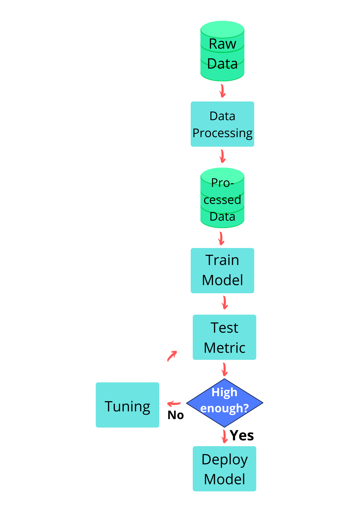

<a href="https://github.com/mariagrandury" target="_blank" alt="GitHub"
  class="abs-tr m-6 text-3xl icon-btn opacity-50 !border-none !hover:text-white">
  <carbon-logo-github />
</a>

# Is Your ML Model Trustworthy?

## María Grandury

---
handle: 'mariagrandury'
layout: intro
introImage: 'https://avatars.githubusercontent.com/u/57645283?v=4'
---

<a href="https://github.com/mariagrandury" target="_blank" alt="GitHub"
  class="abs-tr m-6 text-3xl icon-btn opacity-50 !border-none !hover:text-white"> <carbon-logo-github />
</a>

# About me

- 💡  Machine Learning Research Engineer

- 🎯  **#NLP**, AI Robustness & Explainability (**#XAI**)

- 🎓  Mathematician & Physicist

- 👩🏻‍💻  Trusted AI [**@neurocat.ai**](https://www.neurocat.ai/)

- 🚀  Founder [**@NLP_en_ES**](https://twitter.com/nlp_en_es) 🤗

- ⚡  Core Team [**@WAIRobotics**](https://twitter.com/wairobotics)

---
handle: 'mariagrandury'
---

# Functionality

## Performance Metrics
- Classification:
  - Accuracy, Precision, Recall, F1-score
  - ROC, AUC
- Regression:
  - MSE, MAE
  - Pearson CC, R²
- Ranking: Mean Reciprocal Rank
- NLP:
  - BLEU, ROUGE
  - Perplexity
- GANs:
  - Inception score, Frechet Inception distance

<!-- 

https://towardsdatascience.com/20-popular-machine-learning-metrics-part-1-classification-regression-evaluation-metrics-1ca3e282a2ce 

https://towardsdatascience.com/the-most-common-evaluation-metrics-in-nlp-ced6a763ac8b

-->

---
handle: 'mariagrandury'
---

# How to improve the performance of my ML Model?

If bias == high => 
- Bigger NN (size of hidden units, number of layers)
- Train longer
- Different optimization algorithms

 

If variance == high (i.e. overfitting) =>
- More data (data augmentation)
- Regularization (L2, dropout)

<!-- https://github.com/mbadry1/DeepLearning.ai-Summary/tree/master/2-%20Improving%20Deep%20Neural%20Networks#bias--variance -->

 
 

